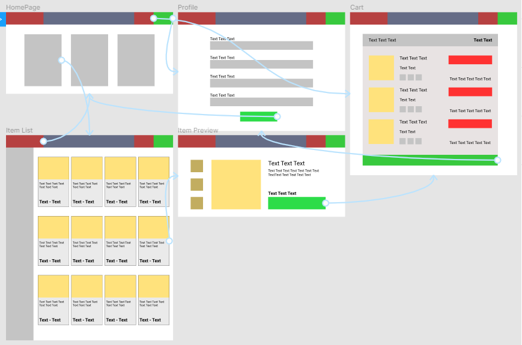

# HardwareWebstore
Grupo de WebDev

## Project Report

**Group: 13**

| **Authors** | **nUSP** |
| --- | --- |
| Luiz Gustavo Sincaruk Vieira | 10374622 |
| Maurílio da Motta Meireles | 10734501 |
| Vitor Kodhi Teruya | 10284441 |

**Diagram**

**Medium-High Fidelity Mockup:**

[Mockups](https://www.figma.com/proto/Fwt6kR6XM6HhqzZK6LvhAx/Medium-High-Fidelity-Mockup?node-id=6%3A2&scaling=min-zoom&page-id=0%3A1)

**Requirements:**

- There will be 2 types of users, Clients and Administrators.
- Admin record will include name, ID, phone number and email address.
- Each customer will need to fill a form that includes name, ID, address, phone
    number and email address.s
- Products will include name, ID, photo, description, price, quantity in stock and
    quantity sold.
- Products are selected, their quantity chosen and are included in a shopping
    cart. Products are purchased using a credit card number.
- Carts are emptied only on payment or by customers.
- Administrators can create/read/update/delete new products.
- We will have a purchase history for the customer. So they can see what they
    bought in our store.

**Project Description:**

We will implement a Hardware Store. We will implementsome functionalities:

- Categories: CPU, GPU, RAM, SSD, HDD, PSU, CPU Cooler,etc.
- Administrator’s form
- Customer 's form
- Purchase history for the customer
- Create/read/update/delete new products
- Shopping Cart

**Comments About the Code:**

Our code doesn't have comments at the moment, cart page and components might be a bit confusing.

**Test Plan:**

At the moment only testing realized is by clicking buttons and links in the webapp, server is not finished yet.

**Test Results:**

The front end of our webstore seems to be working properly.

**Build Procedures:**

Front-end:

    cd webapp
    npm install
    npm run start

Back-end:

    cd server
    yarn install
    yarn dev

**Problems:**

In front-end not all features are covered yet, we are missing: admin page to manage store products, login and sign in page, filter products by category, and listing purchase history for costumers

In back-end it configuring MongoDB took a long time, also we couldn't make server functionalities in time

**Comments:**

Our project is basically unfinished by the time the deadline arrives but can be better developed with some more time